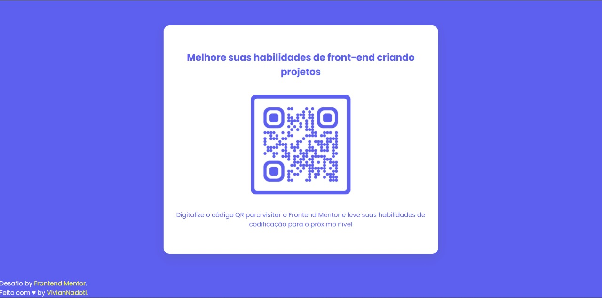

# Frontend Mentor - QR code component solution

Esta é uma solução para o [desafio do componente de código QR no Frontend Mentor](https://www.frontendmentor.io/challenges/qr-code-component-iux_sIO_H). Os desafios do Frontend Mentor ajudam você a melhorar suas habilidades de codificação criando projetos realistas.

## Olá Olá! 👋

Obrigado por conferir está solução para o [desafio do componente de código QR no Frontend Mentor](https://www.frontendmentor.io/challenges/qr-code-component-iux_sIO_H)

Os desafios do [Frontend Mentor](https://www.frontendmentor.io) ajudam a melhorar as habilidades de codificação criando projetos realistas.

**Para fazer esse desafio, você precisa de um conhecimento básico de HTML e CSS.**

---

Visualização do design para o desafio de codificação de componentes de código QR
---

Resultado final
---

---

### Links

- [URL da solução](https://www.frontendmentor.io/solutions/componente-cdigo-qr-com-html-e-css-wL-vLOa1u)
- [URL do site ao vivo](https://qr-code-component-smoky.vercel.app/)

---

## 💻 O desafio 

O desafio era construir este componente de código QR e fazê-lo parecer o mais próximo possível do design. 

Entretanto, o modelo entregue aqui é diferente do modelo do design, eu peguei a ideia principal do desafio e mudei o layout.

Para completar o desafio podia usar qualquer ferramenta para ajudá-lo, no caso utilizei apenas o HTML E CSS para entrega do projeto.

---

## 🚀 Tecnologias

Esse projeto foi desenvolvido com as seguintes tecnologias:

	
	

 

- Marcação semântica HTML5
- Propriedades personalizadas de CSS
- Flexbox
- Grade CSS
- Fluxo de trabalho para dispositivos móveis

---

## Autora

Feito com ♥ by VivianNadoti 
- [Github](https://github.com/vinadoti)
- [Frontend Mentor](https://www.frontendmentor.io/profile/vinadoti)
- [Linkedin](https://www.linkedin.com/in/viviannadoti/)

Este desafio é totalmente gratuito. Por favor, compartilhe-o com qualquer pessoa que achará útil para a prática.

**Have fun building!** 🚀
